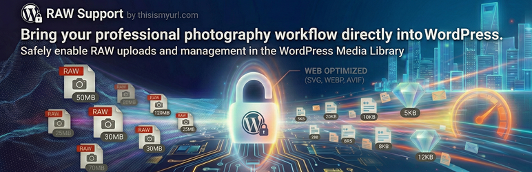

# RAW Support by thisismyurl.com

🔗 **[Register](https://thisismyurl.com/raw-support-thisismyurl/#register)**

Stop struggling with WordPress's default restrictions on vector graphics. As a designer or developer, you need the flexibility of RAW files for crisp, scalable visuals, but WordPress blocks them by default due to their XML-based nature. RAW Support by thisismyurl.com solves this by safely unlocking RAW uploads so you can focus on building beautiful, responsive sites without technical roadblocks.

The plugin is designed with a **Non-Destructive** architecture, ensuring it is active immediately upon installation while remaining completely clean upon uninstallation.

= Key Features =

* Instant RAW Uploads: Start uploading .raw and .rawz files immediately upon activation with zero complex configuration required.
* Perfect Media Library Previews: No more broken icons. The plugin automatically fixes the Media Library grid and list views so your RAW thumbnails render perfectly every time.
* Simplified Management: Control your media settings through a modernized, intuitive dashboard designed for ease of use.
* Rock-Solid Stability: Benefit from a version-aware framework that ensures maximum uptime and prevents conflicts with other tools on your site.
* Direct Access to Support: Integrated plugin registration provides you with a standardized path to professional developer support.
* Zero Technical Debt: When we say clean, we mean it. Our automated uninstaller purges all database options upon removal, keeping your site lean.

## ⚙️ Installation
1. Upload the `thisismyurl-raw-support` folder to the `/wp-content/plugins/` directory.
2. Activate the plugin through the 'Plugins' menu in WordPress.
3. (Optional) Visit 'Tools > RAW Support' to manage your settings.

## ❓ FAQ
### Is this plugin secure?
While this plugin enables the upload of RAW files, it is recommended that only trusted administrators be given upload permissions, as RAWs are XML-based assets.
### Will this slow down my site?
No. The plugin uses minimal hooks and only runs its CSS "fix" within the administrative dashboard, ensuring zero impact on your front-end performance.
### What is the TIMU Core Library?
It is a shared library used across our plugins to provide a consistent UI, unified developer support, and version-safe loading to prevent plugin conflicts.

## 🗺️ Roadmap & Activity

---
© 2026 [thisismyurl](https://thisismyurl.com)